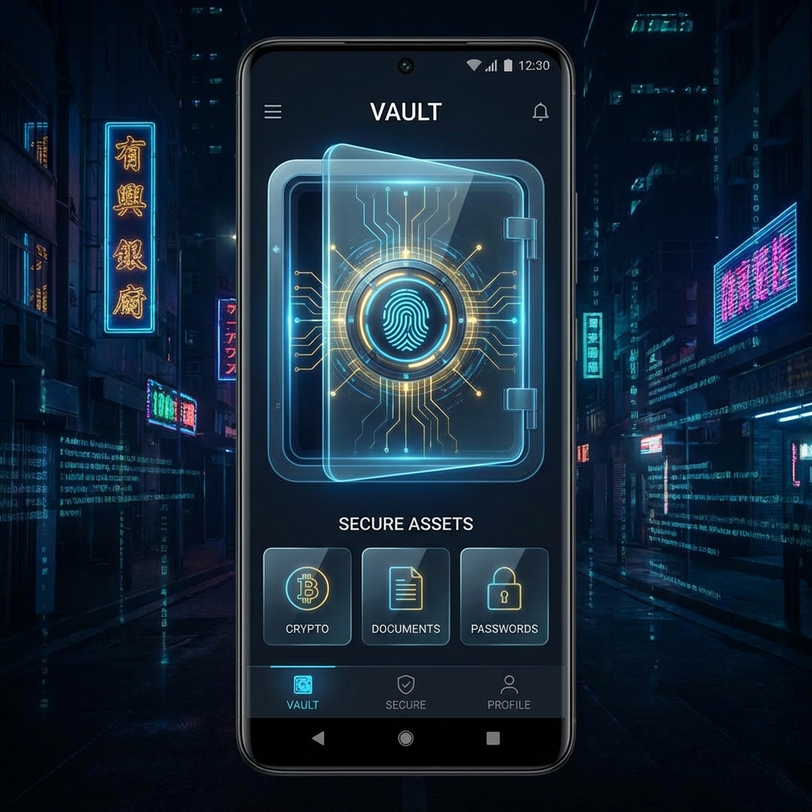
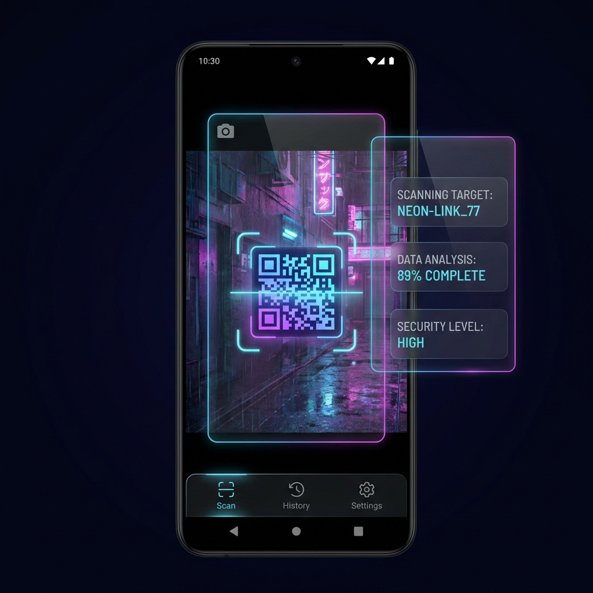

<div align="center">

# 𓅃 Root@𓅃:~/0x1# VaultQR


<br/>

<a href="https://github.com/falcon0x1/VaultQR/releases/latest">
  
</a>

</div>

---

## Mission Statement

**VaultQR** bridges the gap between **Cybersecurity** and **Modern Android Development**. It is a secure, offline, and biometric-protected vault for sensitive QR codes, designed with a **Cyberpunk Glassmorphism** aesthetic.

> **Why I built this:** Standard QR apps often leak metadata to the cloud. VaultQR ensures **Zero Knowledge** privacy—your data is encrypted locally and never leaves the device.

---

## Visual Demo

| Secure Vault | Neon Generator | Cyber Scanner |
|:---:|:---:|:---:|
|  |  |  |
| *Biometric Unlock* | *Custom "Eye" Styling* | *Fast Batch Scanning* |

---

## Technical Architecture

This project follows **Modern Android Development (MAD)** standards and Clean Architecture principles.

* **Architecture:** MVVM (Model-View-ViewModel).
* **UI:** 100% Jetpack Compose with Material3.
* **Concurrency:** Kotlin Coroutines & Flow.
* **DI:** Manual Dependency Injection (Scalable design).

<details>
<summary><strong>Click to view Security Implementation (AES-256)</strong></summary>

### Encryption Strategy
To ensure military-grade security for stored data:

1.  **Key Generation:** A unique 256-bit key is generated and stored in the **Android Keystore System** (hardware-backed).
2.  **Encryption:** Data is encrypted using `AES/GCM/NoPadding`.
3.  **Biometrics:** The decryption key is locked behind `BiometricPrompt`. It can *only* be accessed after a successful fingerprint/face match.

```kotlin
// Snippet: Accessing the SecretKey
val secretKeyEntry = keyStore.getEntry(KEY_ALIAS, null) as KeyStore.SecretKeyEntry
val secretKey = secretKeyEntry.secretKey

```

</details>

<details>
<summary><strong>Click to view Custom QR Generation Logic</strong></summary>

### Custom Canvas Drawing

Instead of standard library rendering, I implemented a custom `Canvas` renderer:

* **Matrix Analysis:** The QR BitMatrix is analyzed to separate "Data Modules" from "Finder Patterns" (Eyes).
* **Exclusion Logic:** Standard square eyes are excluded during the initial pass to prevent graphical artifacts.
* **Custom Shapes:** Custom paths (Hexagons/Circles) are drawn on the Canvas for the specific Cyberpunk aesthetic.

</details>

---

## Features

* **Secure Storage:** Encrypted SQLite database (Room) with Biometric authentication.
* **Styling Engine:** Modify QR dots, eyes, and colors (Gradient/Neon support).
* **High-Performance:** Optimized Scanner using Google ML Kit + CameraX.
* **Privacy Core:**
* No Internet Permission (`<uses-permission android:name="android.permission.INTERNET" />` removed).
* No Analytics SDKs.


---

## Installation

**Option 1: Download APK**
Get the latest stable release from the [Releases Page](https://github.com/falcon0x1/VaultQR/releases).

**Option 2: Build from Source**
To build this project locally:

```bash
git clone [https://github.com/falcon0x1/VaultQR.git](https://github.com/falcon0x1/VaultQR.git)
cd VaultQR
./gradlew assembleDebug

```

---

## About the Engineer

**Mahmoud Elshorpagy (falcon0x1)**
*Security Engineer & Android Developer*

I specialize in building secure, resilient systems. This project demonstrates my ability to combine **Offensive Security** knowledge with **Defensive Programming**.

**[LinkedIn](https://www.linkedin.com/in/mahmoud-elshorbagy-b77b38234/)** • **[Email](mailto:falcon0x1.sec@gmail.com)** • **[GitHub](https://github.com/falcon0x1)**

---

<div align="center">
<i>"Trust Code, Not Corporations."</i>
</div>
